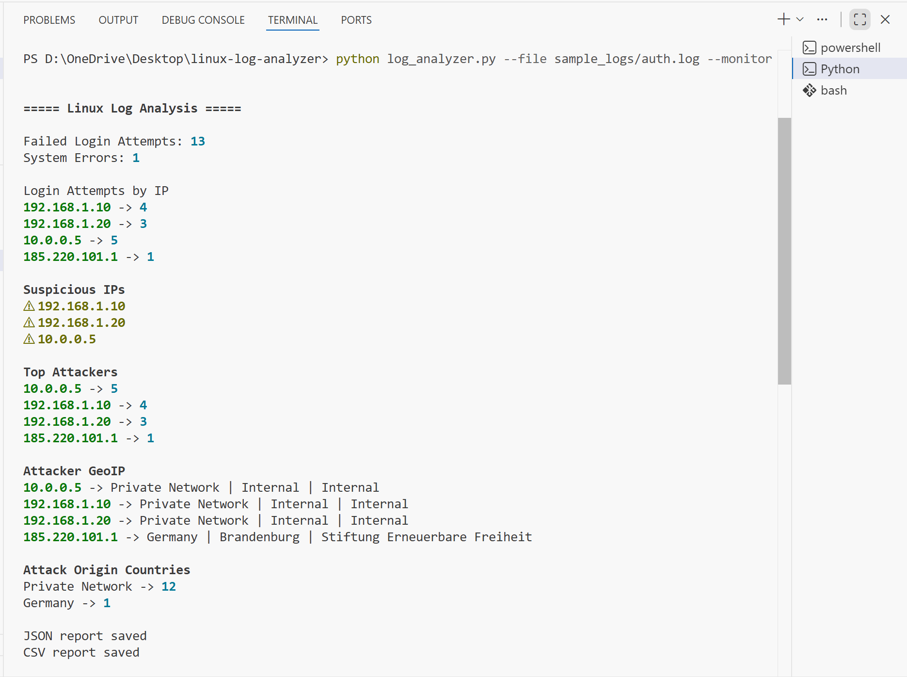
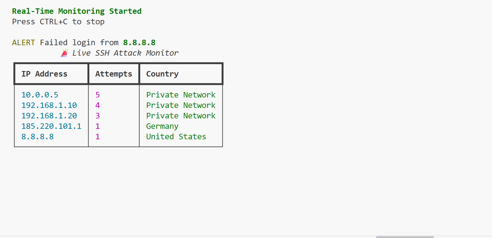

# Linux SSH Log Analyzer

A Python-based command-line tool that analyzes Linux SSH authentication logs (`auth.log`) to detect suspicious login attempts, brute-force attacks, and attacker locations.

This project demonstrates **log parsing, security monitoring, and real-time attack detection** using Python.

---

## Features

- Analyze Linux SSH authentication logs
- Detect failed login attempts
- Identify suspicious IP addresses
- Detect potential brute-force attacks
- GeoIP lookup for attacker location
- Generate attack statistics by country
- Export reports in **JSON** and **CSV** format
- Real-time monitoring with a **live attack dashboard**

---

## Technologies Used

- **Python**
- Regular Expressions (`re`)
- Command-line interface (`argparse`)
- GeoIP API (`requests`)
- Terminal dashboard (`rich`)
- JSON and CSV reporting
- Linux log analysis

---

## Project Structure
    linux-log-analyzer
    │
    ├── log_analyzer.py # Main log analysis script
    ├── sample_logs
    │ └── auth.log # Example SSH authentication log
    │
    ├── assets
    │ ├── analysis.png # Log analysis screenshot
    │ └── dashboard.png # Real-time dashboard screenshot
    │
    ├── README.md
    ├── requirements.txt
    └── .gitignore

---

## Installation

Clone the repository:
        git clone https://github.com/Charulpareek/linux-log-analyzer.git
        cd linux-log-analyzer

Install required dependencies:
    pip install -r requirements.txt

Dependencies used:
      requests
      rich

---

## Quick Demo

Run the analyzer on a sample log file:
```bash
python log_analyzer.py --file sample_logs/auth.log
```
Run real-time monitoring:
```bash
python log_analyzer.py --file sample_logs/auth.log --monitor
```
---

## Example Output

### Log Analysis
    ===== Linux Log Analysis =====
    
    Failed Login Attempts: 13
    System Errors: 1
    
    Login Attempts by IP
    192.168.1.10 -> 4
    192.168.1.20 -> 3
    10.0.0.5 -> 5
    185.220.101.1 -> 1
    
    Suspicious IPs
    ⚠ 192.168.1.10
    ⚠ 192.168.1.20
    ⚠ 10.0.0.5

---

### Real-Time Monitoring Dashboard

The tool provides a real-time dashboard displaying attacker IPs and locations.

Example:

| IP Address | Attempts | Country |
|-------------|-----------|-----------|
| 10.0.0.5 | 5 | Private Network |
| 192.168.1.10 | 4 | Private Network |
| 192.168.1.20 | 3 | Private Network |
| 185.220.101.1 | 1 | Germany |
| 8.8.8.8 | 1 | United States |

---

## Screenshots

### Log Analysis



### Real-Time Monitoring Dashboard



---

## Reports Generated

After analysis the tool generates structured reports.

### JSON Report
report.json

Contains attack statistics in structured format.

### CSV Report

Contains attacker IP addresses and failed login counts.

---

## Example Attack Statistics

| Country | Attempts |
|--------|--------|
| Private Network | 12 |
| Germany | 1 |

These statistics help identify suspicious login patterns and attack origins.

---

## Key Skills Demonstrated

- Python scripting
- Linux system log analysis
- Regular expression log parsing
- CLI tool development
- Real-time monitoring systems
- API integration
- Security event detection

---

## Future Improvements

Possible future enhancements:

- Integration with **SIEM platforms**
- Automated IP blocking (**Fail2Ban-style**)
- Attack timeline visualization
- Support for additional log formats

---

## Author

**Charul Pareek**

GitHub:  
https://github.com/Charulpareek

---

## License

This project is provided for **educational and demonstration purposes**.
